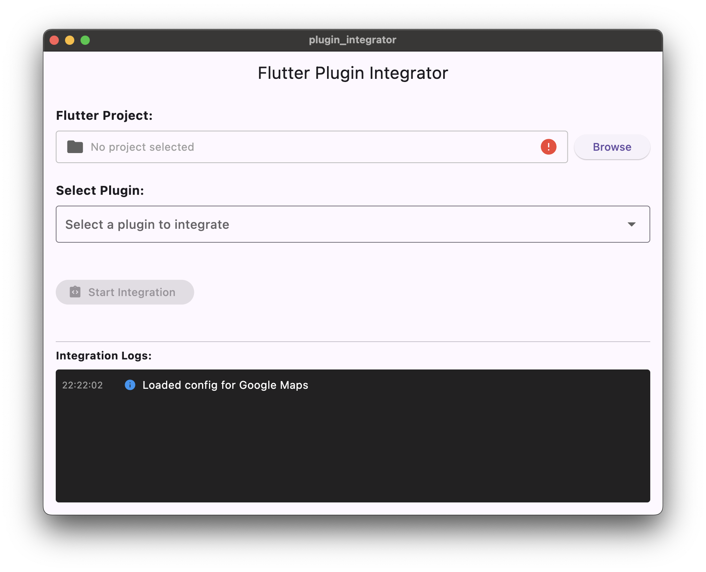

# Flutter Plugin Integrator

A Flutter application that automates the integration of plugins into Flutter projects.



## Description

This project is a Flutter application designed to simplify the process of adding plugins to your Flutter projects. It automates several common steps involved in plugin integration, such as adding dependencies to `pubspec.yaml`, updating platform-specific files (like `AndroidManifest.xml` and `AppDelegate.swift`), and running `flutter pub get`.

## Features

* Select a Flutter project directory.
* Browse and select available plugins.
* Automatically adds plugin dependencies to `pubspec.yaml`.
* Automates modifications to platform-specific files (Android and iOS).
* Handles API key requirements for plugins.
* Provides a console to view integration logs.
* Includes example code integration for selected plugins.

## Getting Started

### Prerequisites

* Flutter SDK installed and configured.
* A Flutter project to integrate plugins into.

### Installation

1.  Clone the repository:
    ```bash
    git clone <repository_url>
    ```
2.  Navigate to the project directory:
    ```bash
    cd plugin_integrator
    ```
3.  Get dependencies:
    ```bash
    flutter pub get
    ```
4.  Run the application:
    ```bash
    flutter run
    ```

## Usage

1.  Launch the application.
2.  Click "Browse" to select the root directory of your Flutter project.
3.  Select a plugin from the "Select Plugin" dropdown.
4.  If the selected plugin requires an API key, enter it in the provided text field.
5.  Click "Start Integration".
6.  Monitor the integration process in the "Integration Logs" console.

## Project Structure

* `lib/models`: Contains data models for enums, file modifications, integration steps, log entries, platform configurations, and plugin configurations.
* `lib/notifiers`: Contains state management using Riverpod for integration status, log entries, selected plugin, and project path.
* `lib/services`: Contains the core logic for plugin integration and fetching available plugins.
* `lib/ui`: Contains the user interface widgets for the home view, log console, plugin selection, and project selector.
* `assets/plugins`: Contains JSON configuration files for available plugins.

## Contributing

Contributions are welcome! Please feel free to submit pull requests or open issues.
